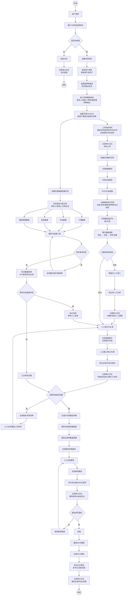

```mermaid
flowchart TD
    Start((开始)) --> A["用户登录"]
    A --> B["租户与项目权限校验"]
    B --> C{"是否有权限"}

    C -- "否" --> C1["拒绝访问"]
    C1 --> C2["记录审计日志<br/>访问拒绝"]
    C2 --> End0((结束))

    C -- "是" --> D["创建尽调项目"]
    D --> D1["选择资产类型<br/>债权类不良资产"]
    D1 --> D2["选择抵押物类型<br/>住宅/商业优先"]
    D2 --> D3["录入项目基础信息<br/>债务人/担保人/债权金额/抵押物地址"]
    D3 --> D4["加载尽调Checklist<br/>按资产类型生成核对清单"]

    D4 --> E["上传项目材料<br/>借款合同/抵押合同/判决书/征信报告/评估资料"]
    E --> E1["记录审计日志<br/>材料上传"]
    E1 --> F["创建异步解析任务"]

    F --> G["文档智能解析"]
    G --> G1["识别文档类型"]
    G1 --> G2["OCR/文本提取"]
    G2 --> G3["AI抽取结构化字段<br/>本金/利率/期限/抵押物/诉讼时效"]
    G3 --> G4["字段置信度评分<br/>高/中/低"]
    G4 --> G5["建立数据溯源<br/>字段 ↔ 文档 ↔ 页码/位置"]

    G5 --> H{"AI解析是否成功"}

    H -- "失败" --> H1["降级为人工录入"]
    H1 --> H2["标记待人工补录"]
    H2 --> H3["记录审计日志<br/>AI解析失败/人工接管"]
    H3 --> I["人工核对与补录"]

    H -- "成功" --> I["人工核对与补录"]
    I --> I1["左侧查看原文<br/>右侧核对字段"]
    I1 --> I2["人工确认/修正/补录"]
    I2 --> I3["评论/@协作/标记疑点"]
    I3 --> I4["记录审计日志<br/>字段前后变化/操作人/时间"]

    D4 --> J["创建外部数据采集任务"]
    J --> J1["并发查询关联主体<br/>债务人/担保人/关联企业"]
    J1 --> J2["工商数据"]
    J1 --> J3["司法数据"]
    J1 --> J4["拍卖数据"]
    J1 --> J5["基础舆情数据"]

    J2 --> K["缓存与结果入库"]
    J3 --> K
    J4 --> K
    J5 --> K

    K --> K1{"是否查询失败"}
    K1 -- "是" --> K2["自动重试/提示备用源"]
    K2 --> K
    K1 -- "否" --> K3["标记数据来源<br/>API/查询时间/主体"]

    K3 --> K4{"是否存在数据冲突"}
    K4 -- "是" --> K5["标记冲突<br/>等待人工采信"]
    K5 --> I
    K4 -- "否" --> L["汇总项目证据"]

    I4 --> M{"关键字段是否完整"}
    L --> M

    M -- "否" --> M1["生成缺失字段清单"]
    M1 --> M2["人工补录/重新上传材料"]
    M2 --> I

    M -- "是" --> N["生成AI尽调报告初稿"]
    N --> N1["报告字段绑定数据库"]
    N1 --> N2["报告内容带数据溯源"]
    N2 --> N3["生成报告草稿版本"]

    N3 --> O["人工复核报告"]
    O --> O1["在线修改报告"]
    O1 --> O2["评论/标记疑点/补充说明"]
    O2 --> O3["记录审计日志<br/>报告修改与版本变化"]

    O3 --> P{"报告是否通过"}

    P -- "否" --> P1["继续修改草稿"]
    P1 --> O

    P -- "是" --> Q["定稿"]
    Q --> Q1["套用Word模板"]
    Q1 --> Q2["生成Word报告"]
    Q2 --> Q3["导出PDF报告<br/>水印/正式提交版"]
    Q3 --> Q4["记录审计日志<br/>报告生成/导出/定稿"]

    Q4 --> End((结束))

```