# 不良资产尽调系统数据库建模文档

> 版本：v0.1  
> 日期：2026-05-12  
> 建模范围：严格基于 `/Users/zzymima0000/Downloads/NPA-ai-main/data` 下的 JSON 返回数据  
> 本版目标：只绘制概念 ER 图，不展开逻辑表字段、物理库设计、索引和建表 SQL。

## 1. 边界说明

本版只基于 `NPA-ai-main/data` 目录中的 JSON 文件。

不使用以下材料作为建模依据：

```text
agents 代码
plan&design 文档
qcc_api_reference PDF / XLS
接口设计说明
前端或 API 服务代码
```

当前 `data` 目录中实际存在 28 个 JSON 文件：

```text
data/projects/博览汇地产有限公司/
├── project_meta.json
└── api_raw/
    ├── 17 个 qcc_*.json
    └── 10 个 gaode_*.json
```

因此，本版概念 ER 图表达的是：

```text
一个尽调项目
→ 一批 JSON 原始返回
→ 从 JSON 中已经出现的业务对象
```

## 2. JSON 数据来源清单

### 2.1 项目元数据

| JSON 文件 | 当前数据含义 | 概念对象 |
|---|---|---|
| `project_meta.json` | 项目名称、采集开始/结束时间、成功/失败/跳过统计 | `Project` |

### 2.2 QCC 返回 JSON

| JSON 文件                               |                                                   当前返回情况 | 概念对象                                               |
| ------------------------------------- | -------------------------------------------------------: | -------------------------------------------------- |
| `qcc_company_basic.json`              |                             企业基础信息 1 组，内含股东 2、人员 4、变更 14 | `Company`、`Shareholder`、`Executive`、`ChangeRecord` |
| `qcc_shareholders.json`               |                                              `cases` 2 条 | `Shareholder`                                      |
| `qcc_actual_controller.json`          |                                 `ControllerDataList` 2 条 | `ControllerCandidate`                              |
| `qcc_beneficial_owner.json`           | `BreakThroughList` 1 条，`ActualExecutives` 5 条，受益路径明细 4 条 | `BeneficialOwner`、`BeneficialPath`                 |
| `qcc_change_records.json`             |                                             `cases` 14 条 | `ChangeRecord`                                     |
| `qcc_judgments_current.json`          |                                             `cases` 72 条 | `JudgmentCase`、`CaseParty`                         |
| `qcc_judgments_historical.json`       |                                              `cases` 0 条 | 暂不入核心 ER                                           |
| `qcc_executions_current.json`         |                                              `cases` 1 条 | `ExecutionCase`                                    |
| `qcc_terminated_current.json`         |                                              `cases` 6 条 | `TerminatedExecutionCase`                          |
| `qcc_terminated_historical.json`      |                                              `cases` 0 条 | 暂不入核心 ER                                           |
| `qcc_dishonest.json`                  |                                              `cases` 1 条 | `DishonestRecord`                                  |
| `qcc_restriction.json`                |                                              `cases` 6 条 | `ConsumptionRestriction`                           |
| `qcc_court_notices_current.json`      |                                              `cases` 1 条 | `CourtNotice`、`CaseParty`                          |
| `qcc_court_notices_historical.json`   |                                              `cases` 0 条 | 暂不入核心 ER                                           |
| `qcc_hearing_notices_historical.json` |                                             `cases` 26 条 | `HearingNotice`、`CaseParty`                        |
| `qcc_filings_details.json`            |                               `Status=201`，`Result=null` | 暂不入核心 ER                                           |
| `qcc_investments.json`                |                                  `cases` 0 条，`Data=null` | 暂不入核心 ER                                           |

### 2.3 高德返回 JSON

| JSON 文件 | 当前返回情况 | 概念对象 |
|---|---:|---|
| `gaode_geocode.json` | 地址解析为经纬度和行政区 | `Location` |
| `gaode_regeocode.json` | 逆地理编码，内含周边 POI 与商圈信息 | `Location`、`BusinessArea`、`POI` |
| `gaode_poi_subway.json` | `pois` 25 条 | `POI` |
| `gaode_poi_school.json` | `pois` 9 条 | `POI` |
| `gaode_poi_hospital.json` | `pois` 3 条 | `POI` |
| `gaode_poi_mall.json` | `pois` 25 条 | `POI` |
| `gaode_poi_bank.json` | `pois` 19 条 | `POI` |
| `gaode_poi_unfavorable.json` | 不利因素 POI 4 条，按墓地/垃圾场/化工厂等分类 | `UnfavorablePOI` |
| `gaode_reference_price.json` | 周边参考小区 1 条 | `ReferencePrice` |
| `gaode_surroundings.json` | 周边聚合评分、数量统计、风险因素 3 条 | `SurroundingsSummary`、`SurroundingRiskFactor` |

## 3. 概念对象清单

| 概念对象                      | 来自 JSON                                                                                   | 是否进入 v0.1 ER | 说明备注                                                                 |
| ------------------------- | ----------------------------------------------------------------------------------------- | ------------ | -------------------------------------------------------------------- |
| `Project`                 | `project_meta.json`                                                                       | 是            | 尽调项目根对象。当前 data 目录只有一个项目实例，项目名为 `博览汇地产有限公司`，并记录采集开始/结束时间和统计结果。       |
| `DataSourceRecord`        | 全部 `api_raw/*.json` 的 `_meta + data` 包装                                                   | 是            | 原始 JSON 返回的统一证据对象。无论业务数据是否为空，`api_raw` 下每个 JSON 都应先作为一条原始返回保存。       |
| `Company`                 | `qcc_company_basic.json.data.Result`                                                      | 是            | 被尽调主体。当前 JSON 中包含企业名称、统一社会信用代码、法定代表人、注册资本、经营状态、注册地址、行业、经营范围等核心信息。    |
| `Shareholder`             | `qcc_company_basic.Result.Partners`、`qcc_shareholders.data.cases`                         | 是            | 股东对象。当前有两个来源，基础信息内嵌股东和独立股东列表均返回 2 条，后续逻辑模型需要处理重复来源和字段差异。             |
| `Executive`               | `qcc_company_basic.Result.Employees`、`qcc_beneficial_owner.Result.ActualExecutives`       | 是            | 人员/高管对象。`Employees` 体现董监高岗位，`ActualExecutives` 体现受益所有人返回中的实际人员和机构列表。 |
| `ChangeRecord`            | `qcc_company_basic.Result.ChangeRecords`、`qcc_change_records.data.cases`                  | 是            | 工商变更记录。当前基础信息内嵌和独立变更 JSON 都有 14 条，包含变更事项、变更前后内容、变更日期等。               |
| `ControllerCandidate`     | `qcc_actual_controller.Result.ControllerDataList`                                         | 是            | 实际控制人候选对象。当前返回 2 条候选，但 `IsActual` 均为字符串标识，概念层先表达候选关系，不判断最终控制人。       |
| `BeneficialOwner`         | `qcc_beneficial_owner.Result.BreakThroughList`                                            | 是            | 受益所有人对象。当前 `BreakThroughList` 返回 1 条，用于表达穿透后的最终受益主体及总持股比例。           |
| `BeneficialPath`          | `qcc_beneficial_owner.Result.BreakThroughList[].DetailInfoList`                           | 是            | 受益路径对象。当前返回 4 条路径明细，表达间接持股链路、层级、穿透比例、出资额等路径信息。                       |
| `JudgmentCase`            | `qcc_judgments_current.data.cases`                                                        | 是            | 裁判文书/司法案件对象。当前返回 72 条，包含案号、案由、涉案金额、裁判结果、裁判日期、发布日期和当事人列表。             |
| `CaseParty`               | `PartyList` / `RoleList` / `ProsecutorList` / `DefendantList`                             | 是            | 案件当事人对象。多个司法 JSON 都有嵌套当事人结构，概念层抽象为统一当事人，后续逻辑模型再区分来源和角色。              |
| `ExecutionCase`           | `qcc_executions_current.data.cases`                                                       | 是            | 被执行案件对象。当前返回 1 条，记录执行案号、执行法院、立案日期、执行标的和申请执行人。                        |
| `TerminatedExecutionCase` | `qcc_terminated_current.data.cases`                                                       | 是            | 终本案件对象。当前返回 6 条，记录终本日期、立案日期、执行标的、未履行金额和法院。                           |
| `DishonestRecord`         | `qcc_dishonest.data.cases`                                                                | 是            | 失信记录对象。当前返回 1 条，包含执行案号、执行法院、履行状态、发布日期、失信原因和金额。                       |
| `ConsumptionRestriction`  | `qcc_restriction.data.cases`                                                              | 是            | 限制高消费记录。当前返回 6 条，限制对象为陈经纬，记录相关公司、申请人、金额、法院和发布日期。                     |
| `CourtNotice`             | `qcc_court_notices_current.data.cases`                                                    | 是            | 法院公告对象。当前返回 1 条，包含公告类别、案由、法院、发布日期，以及原告/被告/角色列表。                      |
| `HearingNotice`           | `qcc_hearing_notices_historical.data.cases`                                               | 是            | 开庭公告对象。当前返回 26 条，包含案号、案由、开庭时间、当事人列表和角色列表。                            |
| `Location`                | `gaode_geocode.data`、`gaode_regeocode.data`、`gaode_surroundings.data`                     | 是            | 地址位置对象。当前围绕注册地址形成经纬度、行政区、格式化地址、街道和周边聚合信息。                            |
| `BusinessArea`            | `gaode_regeocode.data.address_component.businessAreas`                                    | 是            | 商圈对象。当前逆地理编码返回华漕、徐泾等商圈信息，用于表达位置所属或邻近商圈。                              |
| `POI`                     | `gaode_regeocode.data.pois`、`gaode_poi_*.data.pois`                                       | 是            | 周边点位对象。覆盖地铁、学校、医院、商场、银行以及逆地理编码附近 POI，记录名称、类型、地址、坐标、距离、电话等。           |
| `UnfavorablePOI`          | `gaode_poi_unfavorable.data.*.pois`                                                       | 是            | 不利因素点位对象。当前按墓地、垃圾场、化工厂等分类返回 4 条过滤后 POI，应与普通 POI 区分风险类别。              |
| `ReferencePrice`          | `gaode_reference_price.data.nearby_communities`、`gaode_surroundings.data.reference_price` | 是            | 周边参考价格对象。当前返回 1 个附近小区及均价统计，但价格为 0、价格区间未知，后续应保留来源和可信度。                |
| `SurroundingsSummary`     | `gaode_surroundings.data`                                                                 | 是            | 周边聚合摘要对象。汇总地铁、学校、医院、商场、银行、不利因素数量，并给出综合评分 `score=80`。                 |
| `SurroundingRiskFactor`   | `gaode_surroundings.data.risk_factors`                                                    | 是            | 周边风险因素对象。当前返回 3 条文本风险提示，来自不利因素 POI 的聚合结果。                            |
| `Investment`              | `qcc_investments.json` 当前无明细                                                              | 否            | 当前 JSON 文件存在，但 `cases=[]` 且 `Data=null`，v0.1 不作为业务实体入图，只作为原始返回保留。    |
| `CaseFiling`              | `qcc_filings_details.json` 当前 `Result=null`                                               | 否            | 当前返回 `Status=201`、`Result=null`，没有立案明细可抽取，v0.1 不作为核心实体入图。            |

### 3.1 概念对象逐项解释

| 概念对象                      | 解释                                                                                                                                                      |
| ------------------------- | ------------------------------------------------------------------------------------------------------------------------------------------------------- |
| `Project`                 | 尽调项目本身。当前 data 目录按 `data/projects/博览汇地产有限公司/` 组织，`project_meta.json` 记录项目名称、采集时间和采集统计，所以需要一个项目根对象承载整批 JSON。                                             |
| `DataSourceRecord`        | 原始数据返回记录。`api_raw` 下每个 JSON 都有 `_meta` 和 `data` 两部分，`_meta` 说明来源、接口、保存时间，`data` 保存实际返回内容。它用于保证所有业务对象都能追溯到原始 JSON。                                       |
| `Company`                 | 被尽调企业主体。`qcc_company_basic.json.data.Result` 直接返回 `Name`、`CreditCode`、`OperName`、`RegisteredCapital`、`Status`、`Address` 等企业基础信息，因此抽象为核心企业对象。            |
| `Shareholder`             | 股东/出资人。它在两个地方出现：`qcc_company_basic.Result.Partners` 和 `qcc_shareholders.data.cases`。两处都描述股东名称、股东类型、持股比例、认缴金额等，因此抽象为同一个股东对象。                             |
| `Executive`               | 企业人员或高管。`qcc_company_basic.Result.Employees` 返回董事、监事、经理等岗位人员；`qcc_beneficial_owner.Result.ActualExecutives` 也返回实际人员/机构及职位，因此统一抽象为人员对象。                  |
| `ChangeRecord`            | 工商变更记录。`qcc_company_basic.Result.ChangeRecords` 和 `qcc_change_records.data.cases` 都返回变更事项、变更前内容、变更后内容、变更日期等信息，用于记录企业历史变化。                               |
| `ControllerCandidate`     | 实际控制人候选。`qcc_actual_controller.Result.ControllerDataList` 返回可能具有控制影响的人或机构，并给出判断理由。当前样例中是候选信息，不直接断定最终实控人。                                                |
| `BeneficialOwner`         | 受益所有人。`qcc_beneficial_owner.Result.BreakThroughList` 返回穿透后的受益主体和总持股比例，用于表达最终受益关系。                                                                       |
| `BeneficialPath`          | 受益所有人的穿透路径。`BreakThroughList[].DetailInfoList` 中每条记录描述一条间接持股链路，包括层级、路径文本、穿透比例和出资信息，因此单独抽象。                                                              |
| `JudgmentCase`            | 裁判文书/司法案件。`qcc_judgments_current.data.cases` 返回 72 条案件记录，包含案号、案由、案件名称、涉案金额、裁判结果、裁判日期和发布日期。                                                              |
| `CaseParty`               | 案件当事人。裁判文书、法院公告、开庭公告中分别出现 `PartyList`、`RoleList`、`ProsecutorList`、`DefendantList`，这些都描述案件里的原告、被告、申请人、被执行人等角色。                                           |
| `ExecutionCase`           | 被执行案件。`qcc_executions_current.data.cases` 返回当前被执行记录，包含执行案号、执行法院、立案日期、执行标的和申请执行人。                                                                        |
| `TerminatedExecutionCase` | 终本案件。`qcc_terminated_current.data.cases` 返回终结本次执行案件，包含终本日期、立案日期、执行标的、未履行金额和法院。                                                                          |
| `DishonestRecord`         | 失信记录。`qcc_dishonest.data.cases` 返回失信被执行信息，包含执行案号、履行状态、发布日期、失信原因和金额。                                                                                     |
| `ConsumptionRestriction`  | 限制高消费记录。`qcc_restriction.data.cases` 返回限高信息，包含被限制人员、关联公司、申请人、金额、法院、发布日期等。                                                                               |
| `CourtNotice`             | 法院公告。`qcc_court_notices_current.data.cases` 返回公告记录，包含公告类别、案由、法院、发布日期、原告列表、被告列表和角色列表。                                                                    |
| `HearingNotice`           | 开庭公告。`qcc_hearing_notices_historical.data.cases` 返回开庭记录，包含案号、案由、开庭时间、当事人和角色信息。                                                                          |
| `Location`                | 地址/坐标位置。`gaode_geocode.data` 把注册地址解析为经纬度和行政区；`gaode_regeocode.data` 对坐标反查地址；`gaode_surroundings.data` 也保存同一位置的聚合信息。                                     |
| `BusinessArea`            | 商圈。`gaode_regeocode.data.address_component.businessAreas` 返回位置附近或所属商圈，例如当前样例中的华漕、徐泾。                                                                    |
| `POI`                     | 周边兴趣点。`gaode_regeocode.data.pois` 和 `gaode_poi_*.data.pois` 都返回周边点位，覆盖地铁、学校、医院、商场、银行等类别。                                                                |
| `UnfavorablePOI`          | 不利因素点位。`gaode_poi_unfavorable.data.*.pois` 按墓地、垃圾场、化工厂等风险类别组织 POI，业务含义不同于普通配套点位，因此单独抽象。                                                                 |
| `ReferencePrice`          | 周边参考价格。`gaode_reference_price.data.nearby_communities` 和 `gaode_surroundings.data.reference_price` 返回附近小区、价格、距离、均价和价格区间。当前样例价格为 0，说明数据可作为结构保留但不能直接用于估值。 |
| `SurroundingsSummary`     | 周边聚合摘要。`gaode_surroundings.data` 汇总地铁、学校、医院、商场、银行、不利因素数量，并给出综合评分 `score`。                                                                               |
| `SurroundingRiskFactor`   | 周边风险因素。`gaode_surroundings.data.risk_factors` 是文本型风险提示，例如周边发现墓地、垃圾场、化工厂等。                                                                               |
| `Investment`              | 对外投资对象的候选概念。当前 `qcc_investments.json` 存在，但返回 `cases=[]`、`Data=null`，说明当前样例没有投资明细，所以 v0.1 只保留原始返回，不建核心业务对象。                                              |
| `CaseFiling`              | 立案详情对象的候选概念。当前 `qcc_filings_details.json` 返回 `Status=201`、`Result=null`，没有可抽取立案明细，所以 v0.1 不入核心 ER。                                                      |

## 4. v0.1 概念 ER 图

```mermaid
erDiagram
    PROJECT ||--|| COMPANY : target
    PROJECT ||--o{ DATA_SOURCE_RECORD : has_json_return

    DATA_SOURCE_RECORD ||--o| COMPANY : sources
    DATA_SOURCE_RECORD ||--o{ SHAREHOLDER : sources
    DATA_SOURCE_RECORD ||--o{ EXECUTIVE : sources
    DATA_SOURCE_RECORD ||--o{ CHANGE_RECORD : sources
    DATA_SOURCE_RECORD ||--o{ CONTROLLER_CANDIDATE : sources
    DATA_SOURCE_RECORD ||--o{ BENEFICIAL_OWNER : sources
    DATA_SOURCE_RECORD ||--o{ BENEFICIAL_PATH : sources
    DATA_SOURCE_RECORD ||--o{ JUDGMENT_CASE : sources
    DATA_SOURCE_RECORD ||--o{ EXECUTION_CASE : sources
    DATA_SOURCE_RECORD ||--o{ TERMINATED_EXECUTION_CASE : sources
    DATA_SOURCE_RECORD ||--o{ DISHONEST_RECORD : sources
    DATA_SOURCE_RECORD ||--o{ CONSUMPTION_RESTRICTION : sources
    DATA_SOURCE_RECORD ||--o{ COURT_NOTICE : sources
    DATA_SOURCE_RECORD ||--o{ HEARING_NOTICE : sources
    DATA_SOURCE_RECORD ||--o{ LOCATION : sources
    DATA_SOURCE_RECORD ||--o{ BUSINESS_AREA : sources
    DATA_SOURCE_RECORD ||--o{ POI : sources
    DATA_SOURCE_RECORD ||--o{ UNFAVORABLE_POI : sources
    DATA_SOURCE_RECORD ||--o{ REFERENCE_PRICE : sources
    DATA_SOURCE_RECORD ||--o| SURROUNDINGS_SUMMARY : sources
    DATA_SOURCE_RECORD ||--o{ SURROUNDING_RISK_FACTOR : sources

    COMPANY ||--o{ SHAREHOLDER : has
    COMPANY ||--o{ EXECUTIVE : has
    COMPANY ||--o{ CHANGE_RECORD : has
    COMPANY ||--o{ CONTROLLER_CANDIDATE : has
    COMPANY ||--o{ BENEFICIAL_OWNER : has
    BENEFICIAL_OWNER ||--o{ BENEFICIAL_PATH : contains

    COMPANY ||--o{ JUDGMENT_CASE : involved_in
    JUDGMENT_CASE ||--o{ CASE_PARTY : has
    COURT_NOTICE ||--o{ CASE_PARTY : has
    HEARING_NOTICE ||--o{ CASE_PARTY : has

    COMPANY ||--o{ EXECUTION_CASE : has
    COMPANY ||--o{ TERMINATED_EXECUTION_CASE : has
    COMPANY ||--o{ DISHONEST_RECORD : has
    COMPANY ||--o{ CONSUMPTION_RESTRICTION : has
    COMPANY ||--o{ COURT_NOTICE : has
    COMPANY ||--o{ HEARING_NOTICE : has

    COMPANY ||--o{ LOCATION : located_at
    LOCATION ||--o{ BUSINESS_AREA : belongs_to
    LOCATION ||--o{ POI : nearby
    LOCATION ||--o{ UNFAVORABLE_POI : nearby_risk
    LOCATION ||--o{ REFERENCE_PRICE : nearby_price
    LOCATION ||--o| SURROUNDINGS_SUMMARY : summarized_as
    SURROUNDINGS_SUMMARY ||--o{ SURROUNDING_RISK_FACTOR : has
```



## 5. 关系解释

`Project` 是当前 data 目录下的根对象，来自 `project_meta.json`。当前只有一个项目实例：`博览汇地产有限公司`。

`DataSourceRecord` 表示每个 `api_raw/*.json` 原始返回文件。所有 QCC 和高德 JSON 都先作为原始返回保留，再从 `data` 部分抽取业务对象。

`Company` 是被尽调主体，来自 `qcc_company_basic.json.data.Result`。它与股东、人员、工商变更、实控候选、受益所有人、司法记录、执行记录和地址周边数据发生关系。

`Shareholder`、`Executive`、`ChangeRecord` 在 `qcc_company_basic.json` 中已经内嵌出现，同时也有独立的 `qcc_shareholders.json` 和 `qcc_change_records.json` 返回，可以在后续逻辑模型中处理去重和来源优先级。

`BeneficialOwner` 与 `BeneficialPath` 来自 `qcc_beneficial_owner.json`。其中 `BreakThroughList` 表示受益所有人，`DetailInfoList` 表示穿透持股路径。

司法侧分为 `JudgmentCase`、`CourtNotice`、`HearingNotice` 和 `CaseParty`。`CaseParty` 是因为多个 JSON 中都出现了当事人、原告、被告、角色列表等嵌套结构。

执行侧分为 `ExecutionCase`、`TerminatedExecutionCase`、`DishonestRecord` 和 `ConsumptionRestriction`，分别来自被执行、终本、失信、限高 JSON。

高德侧以 `Location` 为中心。地址解析、逆地理编码、周边 POI、参考价格和周边聚合评分都围绕同一位置展开。

`SurroundingsSummary` 是 `gaode_surroundings.json` 中的聚合结果，包含地铁、学校、医院、商场、银行、不利因素数量，以及 `score` 和 `risk_factors`。

## 6. 当前不入核心 ER 的 JSON

以下 JSON 文件存在，但当前返回没有可建模明细记录，因此 v0.1 不画成核心业务对象：

| JSON 文件                             | 当前状态                       | v0.1 处理                 |
| ----------------------------------- | -------------------------- | ----------------------- |
| `qcc_investments.json`              | `cases=[]`，`Data=null`     | 只保留为 `DataSourceRecord` |
| `qcc_filings_details.json`          | `Status=201`，`Result=null` | 只保留为 `DataSourceRecord` |
| `qcc_judgments_historical.json`     | `cases=[]`                 | 只保留为 `DataSourceRecord` |
| `qcc_terminated_historical.json`    | `cases=[]`                 | 只保留为 `DataSourceRecord` |
| `qcc_court_notices_historical.json` | `cases=[]`                 | 只保留为 `DataSourceRecord` |
|                                     |                            |                         |

## 7. v0.1 结论

严格基于 `data` 目录 JSON，本系统的概念模型可以先分为四组：

```text
项目与原始返回
企业画像
司法与执行
地址与周边
```

本版不引入报告、Agent、模板、人工补录、上传附件、接口目录等对象，因为这些对象没有作为当前 `data` JSON 返回数据出现。

下一版 `v0.2` 再做逻辑模型时，可以继续补充：

```text
字段清单
主键与外键
重复来源合并规则
空结果数据源保留规则
JSON 原文追溯字段
```
