# 不良资产尽调系统数据库建模文档

> 版本：v0.2  
> 日期：2026-05-12  
> 建模范围：严格基于 `/Users/zzymima0000/Downloads/NPA-ai-main/data` 下的 JSON 返回数据  
> 本版目标：在 v0.1 概念 ER 图基础上，补充逻辑实体、主外键、核心字段、来源映射、去重规则和空结果保留规则。  
> 本版不写建表 SQL，不引入 `agents` 代码、`plan&design` 文档、接口 PDF 或报告模板。

## 1. v0.2 迭代范围

v0.1 解决的是“有哪些概念对象、对象之间怎么关联”。

v0.2 继续解决：

```text
概念对象
→ 逻辑实体
→ 主键与外键
→ 核心字段
→ JSON 来源路径
→ 重复来源合并规则
→ 空结果保留规则
```

当前 data 目录实际依据仍然是：

```text
data/projects/博览汇地产有限公司/project_meta.json
data/projects/博览汇地产有限公司/api_raw/*.json
```

其中：

```text
project_meta.json：1 个
api_raw/*.json：27 个
```

## 2. 逻辑建模原则

### 2.1 原始 JSON 必须可追溯

所有业务实体都应能追溯到来源 JSON：

```text
project_id
source_record_id
raw_item_json
```

其中：

| 字段 | 含义 |
|---|---|
| `project_id` | 所属项目 |
| `source_record_id` | 来源 JSON 文件记录 |
| `raw_item_json` | 当前实体对应的原始 JSON 片段 |

### 2.2 原始返回与业务对象分离

`DataSourceRecord` 保存完整 JSON 原文。

业务实体只抽取检索、筛选、展示、关联需要的核心字段。

### 2.3 当前无明细的 JSON 不强行建业务表

例如：

```text
qcc_investments.json        cases=[]
qcc_filings_details.json    Result=null
```

这些文件只进入 `data_source_record`，不进入核心业务实体表。

### 2.4 重复来源先保留来源，再做合并

当前 JSON 中存在同一类数据的多来源：

| 对象   | 来源 1                                     | 来源 2                                           |
| ---- | ---------------------------------------- | ---------------------------------------------- |
| 股东   | `qcc_company_basic.Result.Partners`      | `qcc_shareholders.data.cases`                  |
| 工商变更 | `qcc_company_basic.Result.ChangeRecords` | `qcc_change_records.data.cases`                |
| 人员   | `qcc_company_basic.Result.Employees`     | `qcc_beneficial_owner.Result.ActualExecutives` |
|      |                                          |                                                |

v0.2 建议：

```text
先分别保留 source_record_id
再用业务键做去重合并
```

## 3. v0.2 逻辑 ER 图

```mermaid
erDiagram
    project ||--|| company : target
    project ||--o{ data_source_record : has_json_return

    data_source_record ||--o| company : sources
    data_source_record ||--o{ shareholder : sources
    data_source_record ||--o{ executive : sources
    data_source_record ||--o{ change_record : sources
    data_source_record ||--o{ controller_candidate : sources
    data_source_record ||--o{ beneficial_owner : sources
    data_source_record ||--o{ beneficial_path : sources
    data_source_record ||--o{ judgment_case : sources
    data_source_record ||--o{ case_party : sources
    data_source_record ||--o{ execution_case : sources
    data_source_record ||--o{ terminated_execution_case : sources
    data_source_record ||--o{ dishonest_record : sources
    data_source_record ||--o{ consumption_restriction : sources
    data_source_record ||--o{ court_notice : sources
    data_source_record ||--o{ hearing_notice : sources
    data_source_record ||--o{ location : sources
    data_source_record ||--o{ business_area : sources
    data_source_record ||--o{ poi : sources
    data_source_record ||--o{ unfavorable_poi : sources
    data_source_record ||--o{ reference_price : sources
    data_source_record ||--o| surroundings_summary : sources
    data_source_record ||--o{ surrounding_risk_factor : sources

    company ||--o{ shareholder : has
    company ||--o{ executive : has
    company ||--o{ change_record : has
    company ||--o{ controller_candidate : has
    company ||--o{ beneficial_owner : has
    beneficial_owner ||--o{ beneficial_path : contains

    company ||--o{ judgment_case : involved_in
    judgment_case ||--o{ case_party : has
    court_notice ||--o{ case_party : has
    hearing_notice ||--o{ case_party : has

    company ||--o{ execution_case : has
    company ||--o{ terminated_execution_case : has
    company ||--o{ dishonest_record : has
    company ||--o{ consumption_restriction : has
    company ||--o{ court_notice : has
    company ||--o{ hearing_notice : has

    company ||--o{ location : located_at
    location ||--o{ business_area : includes
    location ||--o{ poi : nearby
    location ||--o{ unfavorable_poi : nearby_risk
    location ||--o{ reference_price : nearby_price
    location ||--o| surroundings_summary : summarized_as
    surroundings_summary ||--o{ surrounding_risk_factor : has
```



## 4. 逻辑实体清单

### 4.1 项目与原始返回

| 逻辑实体 | 建议主键 | 主要外键 | 核心字段 | JSON 来源 |
|---|---|---|---|---|
| `project` | `project_id` | 无 | `project_code`、`company_name`、`collection_started_at`、`collection_finished_at`、`total_count`、`success_count`、`failed_count`、`skipped_count`、`updated_at` | `project_meta.json` |
| `data_source_record` | `source_record_id` | `project_id` | `source`、`endpoint`、`saved_at`、`company_name`、`description`、`address`、`aggregated`、`raw_json` | `api_raw/*.json._meta` + 完整 JSON |

备注：

`gaode_surroundings.json` 的 `_meta` 中没有 `endpoint`，但有 `aggregated=true`，所以 `endpoint` 需要允许为空。

### 4.2 企业画像

| 逻辑实体 | 建议主键 | 主要外键 | 核心字段 | JSON 来源 |
|---|---|---|---|---|
| `company` | `company_id` | `project_id`、`source_record_id` | `qcc_key_no`、`qcc_code`、`name`、`credit_code`、`legal_person`、`registered_capital`、`paid_up_capital`、`status`、`address`、`province`、`industry_json`、`scope`、`start_date`、`updated_date` | `qcc_company_basic.data.Result` |
| `shareholder` | `shareholder_id` | `project_id`、`company_id`、`source_record_id` | `external_key_no`、`stock_name`、`stock_type`、`stock_percent`、`should_capi`、`subscribed_capital`、`currency`、`area`、`credit_code`、`subscribed_date` | `qcc_company_basic.Result.Partners`、`qcc_shareholders.data.cases` |
| `executive` | `executive_id` | `project_id`、`company_id`、`source_record_id` | `external_key_no`、`name`、`job`、`stock_percent`、`benefit_type`、`position` | `qcc_company_basic.Result.Employees`、`qcc_beneficial_owner.Result.ActualExecutives` |
| `change_record` | `change_record_id` | `project_id`、`company_id`、`source_record_id` | `project_name`、`change_subject`、`before_content_json`、`after_content_json`、`change_date` | `qcc_company_basic.Result.ChangeRecords`、`qcc_change_records.data.cases` |
| `controller_candidate` | `controller_candidate_id` | `project_id`、`company_id`、`source_record_id` | `external_key_no`、`name`、`is_actual`、`judge_reason`、`con_info_json`、`stock_info_json` | `qcc_actual_controller.Result.ControllerDataList` |
| `beneficial_owner` | `beneficial_owner_id` | `project_id`、`company_id`、`source_record_id` | `external_key_no`、`name`、`total_stock_percent`、`benefit_type`、`position`、`calculation` | `qcc_beneficial_owner.Result.BreakThroughList` |
| `beneficial_path` | `beneficial_path_id` | `project_id`、`beneficial_owner_id`、`source_record_id` | `level`、`path`、`stock_type`、`stock_percent`、`breakthrough_stock_percent`、`should_capi`、`capital_type` | `qcc_beneficial_owner.Result.BreakThroughList[].DetailInfoList` |

### 4.3 司法与执行

| 逻辑实体 | 建议主键 | 主要外键 | 核心字段 | JSON 来源 |
|---|---|---|---|---|
| `judgment_case` | `judgment_case_id` | `project_id`、`company_id`、`source_record_id` | `external_case_id`、`case_no`、`case_name`、`case_reason`、`case_type`、`amount`、`is_prosecutor`、`is_defendant`、`judge_result`、`judge_date`、`publish_date` | `qcc_judgments_current.data.cases` |
| `case_party` | `case_party_id` | `project_id`、`source_record_id` | `parent_type`、`parent_external_id`、`party_key_no`、`party_name`、`role_type`、`role_name`、`statement` | `PartyList` / `RoleList` / `ProsecutorList` / `DefendantList` |
| `execution_case` | `execution_case_id` | `project_id`、`company_id`、`source_record_id` | `external_case_id`、`case_no`、`filing_date`、`execute_court`、`execute_amount`、`applicant` | `qcc_executions_current.data.cases` |
| `terminated_execution_case` | `terminated_execution_case_id` | `project_id`、`company_id`、`source_record_id` | `external_case_id`、`case_no`、`court`、`filing_date`、`end_date`、`execute_subject`、`unperformed_amount` | `qcc_terminated_current.data.cases` |
| `dishonest_record` | `dishonest_record_id` | `project_id`、`company_id`、`source_record_id` | `external_case_id`、`case_no`、`filing_date`、`execute_court`、`execute_status`、`public_date`、`execute_no`、`action_remark`、`amount` | `qcc_dishonest.data.cases` |
| `consumption_restriction` | `consumption_restriction_id` | `project_id`、`company_id`、`source_record_id` | `external_case_id`、`case_no`、`person_name`、`person_id`、`judge_date`、`publish_date`、`applicant`、`amount`、`execute_court` | `qcc_restriction.data.cases` |
| `court_notice` | `court_notice_id` | `project_id`、`company_id`、`source_record_id` | `external_notice_id`、`case_no`、`case_reason`、`category`、`court`、`publish_date` | `qcc_court_notices_current.data.cases` |
| `hearing_notice` | `hearing_notice_id` | `project_id`、`company_id`、`source_record_id` | `external_hearing_id`、`case_no`、`case_reason`、`court_time` | `qcc_hearing_notices_historical.data.cases` |

备注：

`case_party.parent_type` 建议枚举为：

```text
judgment_case
court_notice
hearing_notice
```

这样可以统一承载不同 JSON 中的当事人结构。

### 4.4 地址与周边

| 逻辑实体 | 建议主键 | 主要外键 | 核心字段 | JSON 来源 |
|---|---|---|---|---|
| `location` | `location_id` | `project_id`、`company_id`、`source_record_id` | `formatted_address`、`address`、`location`、`province`、`city`、`district`、`adcode`、`street`、`level` | `gaode_geocode.data`、`gaode_regeocode.data`、`gaode_surroundings.data` |
| `business_area` | `business_area_id` | `project_id`、`location_id`、`source_record_id` | `external_area_id`、`name`、`location` | `gaode_regeocode.data.address_component.businessAreas` |
| `poi` | `poi_id` | `project_id`、`location_id`、`source_record_id` | `external_poi_id`、`poi_group`、`name`、`type`、`address`、`location`、`distance`、`tel`、`businessarea` | `gaode_regeocode.data.pois`、`gaode_poi_*.data.pois` |
| `unfavorable_poi` | `unfavorable_poi_id` | `project_id`、`location_id`、`source_record_id` | `risk_category`、`external_poi_id`、`name`、`type`、`address`、`location`、`distance`、`tel` | `gaode_poi_unfavorable.data.*.pois` |
| `reference_price` | `reference_price_id` | `project_id`、`location_id`、`source_record_id` | `community_name`、`price`、`address`、`distance`、`avg_price`、`price_range` | `gaode_reference_price.data.nearby_communities`、`gaode_surroundings.data.reference_price` |
| `surroundings_summary` | `surroundings_summary_id` | `project_id`、`location_id`、`source_record_id` | `subway_count`、`school_count`、`hospital_count`、`mall_count`、`bank_count`、`unfavorable_count`、`score`、`business_area`、`sources_json`、`failed_json` | `gaode_surroundings.data` |
| `surrounding_risk_factor` | `risk_factor_id` | `project_id`、`surroundings_summary_id`、`source_record_id` | `risk_text` | `gaode_surroundings.data.risk_factors[]` |

## 5. 字段来源映射

### 5.1 Company 字段映射

| 逻辑字段 | JSON 路径 |
|---|---|
| `qcc_key_no` | `qcc_company_basic.data.Result.KeyNo` |
| `qcc_code` | `qcc_company_basic.data.Result.QccCode` |
| `name` | `qcc_company_basic.data.Result.Name` |
| `credit_code` | `qcc_company_basic.data.Result.CreditCode` |
| `legal_person` | `qcc_company_basic.data.Result.OperName` |
| `registered_capital` | `qcc_company_basic.data.Result.RegisteredCapital` |
| `paid_up_capital` | `qcc_company_basic.data.Result.PaidUpCapital` |
| `status` | `qcc_company_basic.data.Result.Status` |
| `address` | `qcc_company_basic.data.Result.Address` |
| `industry_json` | `qcc_company_basic.data.Result.Industry` |
| `scope` | `qcc_company_basic.data.Result.Scope` |
| `start_date` | `qcc_company_basic.data.Result.StartDate` |
| `updated_date` | `qcc_company_basic.data.Result.UpdatedDate` |

### 5.2 Judicial 字段映射

| 逻辑实体 | 关键字段 | JSON 路径 |
|---|---|---|
| `judgment_case` | `external_case_id` | `qcc_judgments_current.data.cases[].Id` |
| `judgment_case` | `case_no` | `qcc_judgments_current.data.cases[].CaseNo` |
| `judgment_case` | `amount` | `qcc_judgments_current.data.cases[].Amount` |
| `execution_case` | `case_no` | `qcc_executions_current.data.cases[].Anno` |
| `execution_case` | `execute_amount` | `qcc_executions_current.data.cases[].Biaodi` |
| `terminated_execution_case` | `unperformed_amount` | `qcc_terminated_current.data.cases[].UnperformedAmt` |
| `dishonest_record` | `action_remark` | `qcc_dishonest.data.cases[].ActionRemark` |
| `consumption_restriction` | `person_name` | `qcc_restriction.data.cases[].PersonName` |

### 5.3 Gaode 字段映射

| 逻辑实体 | 关键字段 | JSON 路径 |
|---|---|---|
| `location` | `location` | `gaode_geocode.data.location` |
| `location` | `formatted_address` | `gaode_geocode.data.formatted_address` |
| `business_area` | `name` | `gaode_regeocode.data.address_component.businessAreas[].name` |
| `poi` | `external_poi_id` | `gaode_poi_*.data.pois[].id` |
| `poi` | `distance` | `gaode_poi_*.data.pois[].distance` |
| `unfavorable_poi` | `risk_category` | `gaode_poi_unfavorable.data` 的一级键，如 `墓地`、`垃圾场`、`化工厂` |
| `reference_price` | `community_name` | `gaode_reference_price.data.nearby_communities[].name` |
| `surroundings_summary` | `score` | `gaode_surroundings.data.score` |
| `surrounding_risk_factor` | `risk_text` | `gaode_surroundings.data.risk_factors[]` |

## 6. 去重与合并规则

### 6.1 股东去重

同一股东可能同时出现在：

```text
qcc_company_basic.Result.Partners
qcc_shareholders.data.cases
```

建议匹配键：

```text
company_id + external_key_no
```

如果 `external_key_no` 为空，则退化为：

```text
company_id + stock_name + stock_percent
```

字段优先级：

```text
qcc_shareholders.data.cases 优先
qcc_company_basic.Result.Partners 补充
```

### 6.2 工商变更去重

同一变更可能同时出现在：

```text
qcc_company_basic.Result.ChangeRecords
qcc_change_records.data.cases
```

建议匹配键：

```text
company_id + project_name + change_date + before_content + after_content
```

### 6.3 POI 去重

POI 可能出现在：

```text
gaode_regeocode.data.pois
gaode_poi_*.data.pois
```

建议匹配键：

```text
location_id + external_poi_id
```

如果 `external_poi_id` 为空，则退化为：

```text
location_id + name + address + location
```

### 6.4 司法案件去重

`judgment_case` 当前只从 `qcc_judgments_current` 入库。

建议匹配键：

```text
company_id + external_case_id
```

如果 `external_case_id` 为空，则退化为：

```text
company_id + case_no + case_name + judge_date
```

## 7. 空结果保留规则

以下 JSON 当前没有业务明细，但必须保留在 `data_source_record`：

| JSON 文件 | 当前状态 | 处理方式 |
|---|---|---|
| `qcc_investments.json` | `cases=[]`、`Data=null` | 不生成 `investment`，保留原始 JSON |
| `qcc_filings_details.json` | `Status=201`、`Result=null` | 不生成 `case_filing`，保留原始 JSON |
| `qcc_judgments_historical.json` | `cases=[]` | 不生成 `judgment_case`，保留原始 JSON |
| `qcc_terminated_historical.json` | `cases=[]` | 不生成 `terminated_execution_case`，保留原始 JSON |
| `qcc_court_notices_historical.json` | `cases=[]` | 不生成 `court_notice`，保留原始 JSON |

保留原因：

```text
证明已采集过该来源
保留接口返回状态
支持后续重采或差异比对
避免把“未采集”和“采集无结果”混为一谈
```

## 8. v0.2 结论

严格基于 `data` 目录 JSON，v0.2 推荐的逻辑模型由 24 个逻辑实体组成：

```text
project
data_source_record
company
shareholder
executive
change_record
controller_candidate
beneficial_owner
beneficial_path
judgment_case
case_party
execution_case
terminated_execution_case
dishonest_record
consumption_restriction
court_notice
hearing_notice
location
business_area
poi
unfavorable_poi
reference_price
surroundings_summary
surrounding_risk_factor
```

其中 `project` 与 `data_source_record` 属于基础支撑实体，其余 22 个为业务实体。

下一版 v0.3 可以继续做：

```text
字段类型
字段是否可空
索引建议
唯一约束
建表 SQL 草案
样例数据入库映射
```
